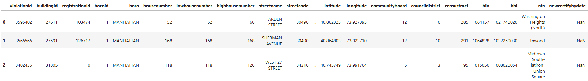
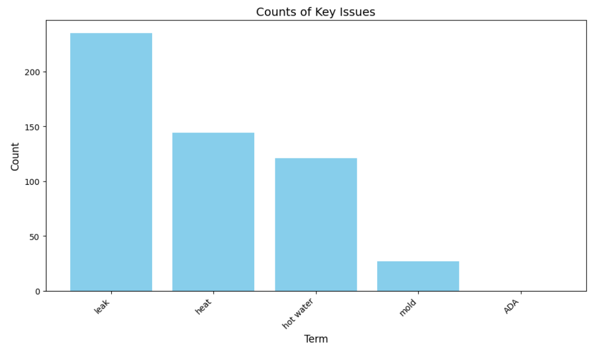
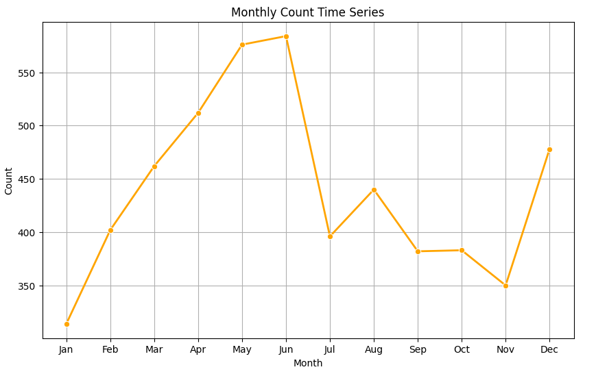
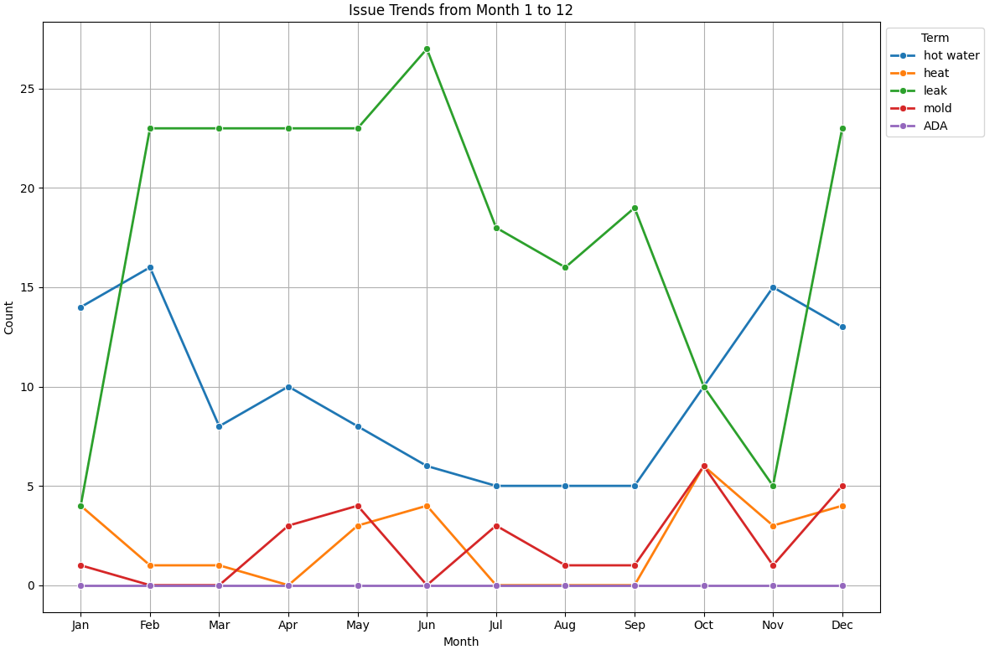

# housing_violations_nyc

housing_violations_nyc is a Python package that allows users to query and analyze NYC housing violation data from the NYC Open Data API. It provides functionalities to fetch, clean, and visualize housing violations by borough and year, offering insights into violation types, seasonal trends, and geographic distributions.

## Installation

```bash
$ pip install housing_violations_nyc
```

## Dependencies

housing_violations_nyc requires the following packages:

matplotlib >=3.9.3, <4.0.0

pandas >=2.2.3, <3.0.0

requests >=2.32.3, <3.0.0

seaborn >=0.13.2, <0.14.0

## Package Links

PyPI: [housing_violations_nyc on PyPI](https://pypi.org/project/housing-violations-nyc/)

GitHub Repository: [housing_violations_nyc on GitHub](https://github.com/jennaswartz88/housing_violations_nyc)

## Running Tests

After installing the package, you can run the test suite using pytest:

```bash
poetry run pytest
```

Example output:

```bash
============================= test session starts =============================
platform win32 -- Python 3.12.3, pytest-8.3.4, pluggy-1.5.0
rootdir: C:\Users\jenna\Documents\housing_violations_nyc
configfile: pyproject.toml
testpaths: tests
collected 4 items

tests\test_housing_violations_nyc.py .... [100%]

============================= 4 passed in 11.57s =============================
```

## Usage

### Importing the package

```bash
import housing_violations_nyc
```

### Checking available functions

```bash
dir(housing_violations_nyc)
```

### Fetching housing violation data

You can fetch data for a given borough and year using:

```bash
from housing_violations_nyc.housing_violations_nyc import get_housing_data

df = get_housing_data("manhattan", 2000)
print(df.head())
```

#### Example Output:



#### Note
- The API query has a limit of 100,000 rows. If the dataset exceeds this limit, only a sample is returned.
- Example output shows 7,420 rows returned for Manhattan in 2000.

### Data Cleaning Functions

The package includes functions for data cleaning and filtering:

```bash
from housing_violations_nyc.housing_violations_nyc import (
    select_key_columns, clean_inspection_date, drop_nas
)
```

#### Note
- clean_inspection_date must be run on dataframe first in order to run subsequent functions grouping and visualizing violations over time.

### Example: Visualizing Violation Type Frequencies

To visualize the most common violations in Manhattan in 2000:

```bash
import matplotlib.pyplot as plt
from housing_violations_nyc.housing_violations_nyc import (count_key_issues, plot_key_issues)

issue_counts = count_key_issues(df)
plot_key_issues(issue_counts)
```

#### Example Output:



For this sample queried dataset (Manhattan in the year 2000), leaks were the most commonly reported violation followed by heating violations.

### Example

### Example: Visualizing General Seasonal Trends

```bash
from housing_violations_nyc.housing_violations_nyc import (count_by_month, plot_time_series)

month_counts = count_by_month(df)
plot_time_series(month_counts)
```

#### Example Output:



It looks like in Manhattan in 2000, there was a steep incline yet steady incline in the first half of the year, with the fewest violations in January and the most violations in June. I would have expected more violations in winter months (with insufficient heat or hot water being common tenant complaints), but perhaps many tenants are moving to new housing units in the spring and summer months, thus reporting any issues they've found in their new units to Code Enforcement. Code Enforcement could also simply be slower to respond in the lower volume months, especially in January when many city employees are returning from winter vacation.

### Visualizing Seasonal Trends by Violation Type

```bash
from housing_violations_nyc.housing_violations_nyc import (count_key_issues_by_month, plot_time_series)

by_month_issues = count_key_issues_by_month(df)
plot_time_series(by_month_issues)
```

#### Example Output:



This plot helps us visualize how the prevalence of each violation type changes throughout the year 2000 in Manhattan. As expected, there were more violations involving hot water in the winter months. There were many reported violations involving leaks in most months, other than January and November. Again though, these slower months could have been due to lack of Code Enforcement reponse in these months versus lack of tenant complaints.

## Contributing

Interested in contributing? Check out the contributing guidelines. Please note that this project is released with a Code of Conduct. By contributing to this project, you agree to abide by its terms.

## License

`housing_violations_nyc` was created by Jenna Swartz. It is licensed under the terms of the MIT license.

## Credits

`housing_violations_nyc` was created with [`cookiecutter`](https://cookiecutter.readthedocs.io/en/latest/) and the `py-pkgs-cookiecutter` [template](https://github.com/py-pkgs/py-pkgs-cookiecutter).
